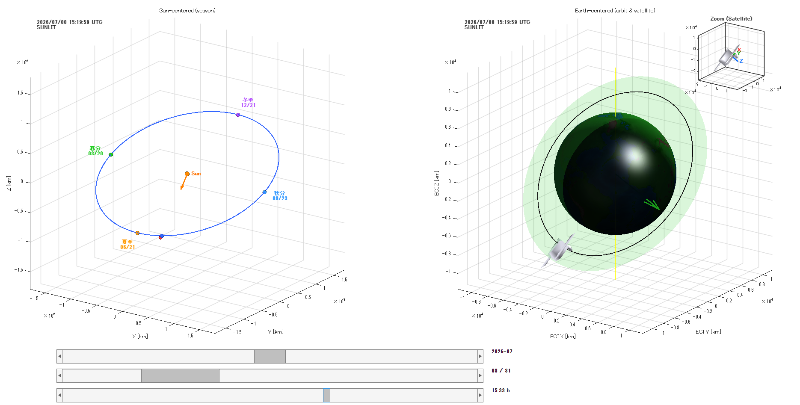

# sun-earth-sat-dynamics-viewer

太陽中心（ヘリオセントリック）視点で地球の公転と衛星の地球周回を可視化する MATLAB スクリプトです。  
UI（スライダー）で月 / 日 / 時刻を直感的に操作し、任意時刻の太陽方向・昼夜境界（ターミネータ）・衛星位置・軌道面を表示できます。

> English (short): A MATLAB visualization tool for Sun-centered Earth orbit and Earth-centered satellite motion with UI sliders (month/day/hour). It renders satellite CAD models from STL, shows the instantaneous orbit plane, and provides a satellite zoom inset with an attitude triad.

---

## Features

- **Sun-centered view (left)**
  - 地球の公転軌道（1年分）
  - 地球の移動（テクスチャ付き地球、昼夜陰影、ターミネータ）
  - 春分・夏至・秋分・冬至のマーカー表示（近似日付）
  - 太陽の橙色マーカー表示（原点）

- **Earth-centered view (right)**
  - 地球テクスチャに地球自転（GMST）を反映（テクスチャが回転）
  - 衛星の現在位置（STLモデル表示 / フォールバック点）
  - 現在時刻の 瞬時軌道（軌道線）のみを表示
  - 軌道面（半透明ディスク）+ 法線ベクトル矢印
  - 簡易地球影（食）判定（円柱影近似）

- **Satellite Zoom Inset (right-top)**
  - 右図右上に衛星のみの拡大図（インセット）を表示  
    ※地球は表示しない（衛星確認に特化）
  - 拡大図に衛星中心からのXYZ矢印（トライアド）を表示
    - 矢印は衛星姿勢（固定姿勢＋任意スピン）に追従
    - 矢印長は拡大図のズーム幅に応じて自動調整

- **UI**
  - メインスライダー：月（`2000+n年1月`〜`2000+n+1年1月`）
  - サブスライダー：日にち（1〜月末）
  - サブスライダー：時刻（0〜24h）
  - 時刻は分刻み（例：1/5/10分）で量子化が可能（設定で変更）

- **STL loading**
  - `stlread` が使える環境ではそれを利用
  - `stlread` が無い場合でもローカルSTLリーダ（ASCII/Binary）で読み込みを試行  
    → 失敗時はフォールバック点表示

---

## Demo / Screenshot

**図の説明（左：太陽中心 / 右：地球中心）**
- **左図（太陽中心）**：太陽を原点として、地球の公転軌道（1年分）と現在位置（青点）を表示します。地球にはテクスチャと昼夜陰影（ターミネータ）が描かれ、季節変化が直感的に分かります。春分・夏至・秋分・冬至の位置も軌道上にマーカーで表示します。
- **右図（地球中心）**：地球中心座標系で衛星の現在位置を表示します（STLモデルを読み込み可能）。同時に、その時刻の瞬時軌道（軌道線）と軌道面（半透明ディスク）、軌道面法線ベクトルを描画します。地球テクスチャはGMSTに基づいて回転します。
- **右上拡大図**：衛星のみをズーム表示し、衛星中心からXYZ矢印（トライアド）を表示します。矢印は衛星姿勢に追従し、長さはズーム幅に応じて自動調整されます。
- **下部スライダー**：`月 → 日 → 時刻` の順に指定し、選択した時刻にジャンプして可視化を更新します。時刻は設定により分刻みで操作できます。

> English (short): Left panel shows Earth’s heliocentric orbit and seasonal markers with day/night terminator. Right panel shows rotating Earth texture (GMST), the satellite (STL), instantaneous orbit curve and orbit plane. The inset shows a satellite-only zoom with an attitude triad.

---

## Usage

1. `visualizeSunEarthSat_UI_3sliders.m` を MATLAB のカレントフォルダへ配置  
2. （任意）`satellite.stl` を同じフォルダへ配置  
3. 実行：

---

## License

This project is licensed under the MIT License.